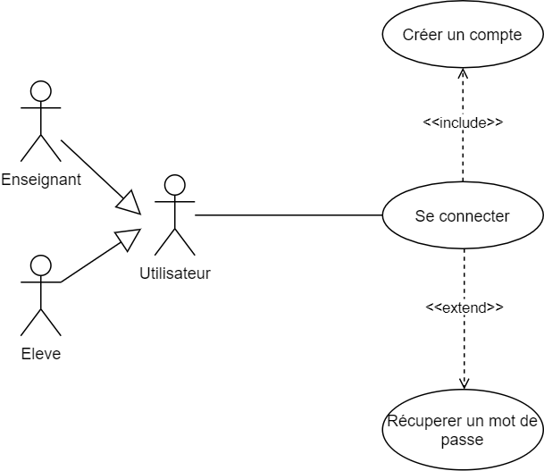
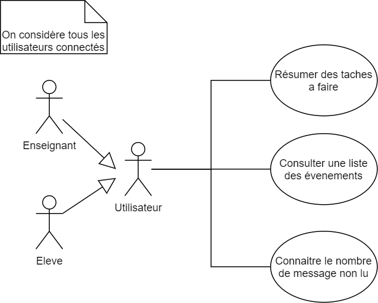
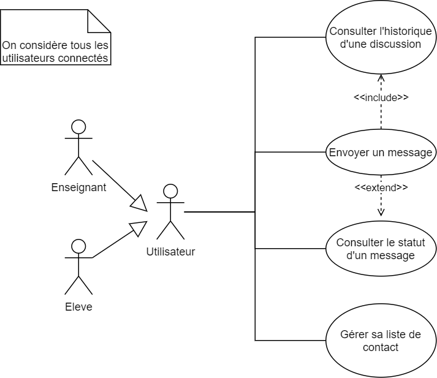
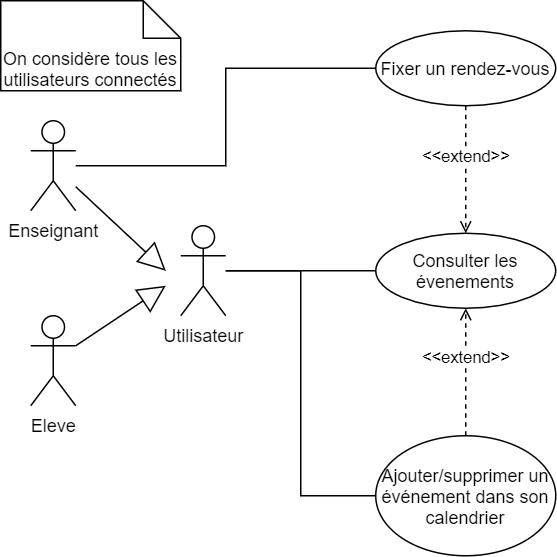

<h1>Définissez les besoins pour une application de soutien scolaire</h1>

 Learn@Home : L’objectif de cette mission est de réaliser le cadrage du projet avec le client, avant de démarrer le développement fonctionnel. En tant que responsable du projet, c’est vous qui allez produire les différents éléments sur lesquels votre équipe devra travailler.

<h2>Version web</h2>

<a href="https://willy-tec.github.io/WastiauxWilliam_10_19062021/">Cliquez ici</a> pour visualiser cette page dans une version embellie

<h2>Les user story</h2>

<a href="./user_story">C'est par ici</a>

<h2>Les diagrammes de cas d'usage</h2>
<h3>Page de login</h3>

<h3>Page du dashboard</h3>

<h3>Page du messagerie</h3>

<h3>Page du calendrier</h3>

<h3>Page des tâches en cour</h3>

<h2>Le kanban</h2>

Il est disponible dans la section projet du repo github <a href="https://github.com/Willy-tec/WastiauxWilliam_10_19062021/projects/1">(ici)</a>

<h2>Les liens pour les maquettes adobe xD</h2>

Vous pouvez visualiser les maquettes même si vous n'avez pas de compte

<a href="https://xd.adobe.com/view/111f3620-8ea3-48bf-8061-bf9ac952bc0c-444c/">Maquette pour la version mobile</a>

<a href="https://xd.adobe.com/view/a670fae2-d737-48f2-8825-49767ef05deb-f323/">Maquette pour la version desktop</a>
